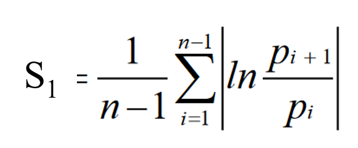
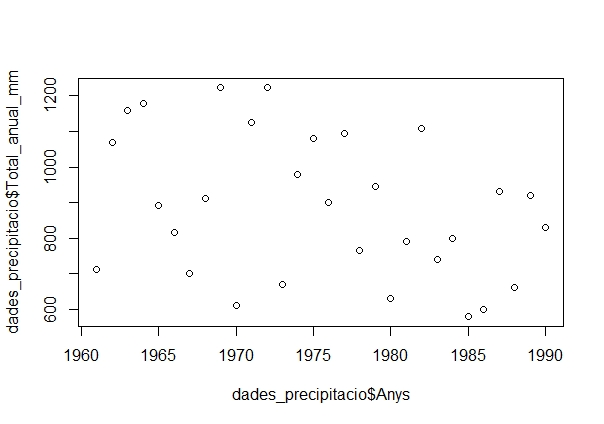
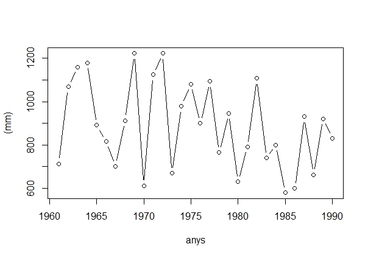

# Pràctica 5: Índexs Pluviomètrics

Introducció
--------

La present pràctica és tan sols una demostració de com realitzaríem els càlculs del coeficient de variació i l'índex de disparitat consecutiva en l'entorn de programació R. Com que el nivell necessari de programació per realitzar aquests càlculs és més elevat que el de la pràctica 2, en aquest cas no hi haurà l'opció de realitzar la pràctica amb R. No obstant això, **es valorarà positivament** que segueixis el codi que aquí es presenta i que provis d'executar-lo al teu ordinador. Al final de l'script realitzaràs un parell de mapes per veure la distribució espacial dels índexs pluviomètrics **que podeu adjuntar al document final que entregueu**. 

Recorda que els fitxers per seguir aquesta pràctica es troben al campus virtual. Aquests arxius són:

- ***estacions_p_anual.txt***: un document de text que conté les dades pluviomètriques de 8 observatoris de la Península Ibèrica.
- ***coordenades.txt***: document de text que conté les coordenades d'aquests 8 observatoris (ens servirà per fer el mapa final).


Primers passos
------------

En aquesta pràctica farem ús de dos **packages**. Però què són els packages? Un package no deixa de ser una col·lecció de funcions R que es guarden en un paquet. Si nosaltres importem aquest paquet, podem fer-les servir. 
Així doncs en aquesta pràctica farem servir, els paquets rworldmap i sp. El primer serveix per visualitzar el mapa del món i poder-lo fer servir com a base del nostre mapa final. D'altra banda, el paquet sp serveix per visualitzar les nostres dades en un mapa.

Per tant, el primer que haurem de fer és instal·lar aquests dos paquets amb l'ordre `install.packages("nom_del_paquet")`. Un cop realitzada la instal·lació ja podem comenár amb la pràctica. 

``` r
# install.packages("rworldmap")
# install.packages("sp")
library(rworldmap)
library(sp)
```

A continuació, llegim les sèries anuals de precipitació de la Península Ibèrica:

``` r
setwd("D:/1. CCAA/practiques/p5/R") # configurem el directori

dades <- read.table(file = "estacions_p_anual.txt", sep = "\t",
                    dec = ".", header = T)
                    
# Fem una ullada a l'estructura de les dades:
head(dades)
```
De moment, ja hem aconseguit establir el nostre directori i carregar les dades a R. Pots veure que hem assignat un nom a les dades que hem carregat: **dades_precipitacio**. Ara anem a veure què podem fer amb aquestes dades.


Càlcul del Coeficient de Variació (CV)
------------
Necessitem calcular la mitjana i la desviació estàndard de cada sèrie per obtenir el CV. Això ho podem fer de la següent manera: 
mitjana_sts <- colMeans(dades)[-1] # amb el -1 eliminem la primera dada que conté els anys
sd_sts <- apply(dades, 2, sd) [-1]
``` r
mitjana_sts <- colMeans(dades)[-1] # amb el -1 eliminem la primera dada que conté els anys
sd_sts <- apply(dades, 2, sd) [-1]
```
`colMeans` és una funció que el que fa és realitzar la mitjana per cada columna.

La funció `apply`, molt usada a R, serveix per aplicar una funció sobre una taula de dades. En aquest cas hem fet servir la funció "sd", sobre les columnes (2) de la nostra taula (dades). 

Amb el càlcul de la mitjana i la desviació estàndard ja podem procedir a calcular el CV:
``` r
sts_cv <- (sd_sts/mitjana_sts)*100
```
Aquesta seria una manera lenta de calcular el CV, però R ens permet crear una funció que computi el CV en qualsevol taula de dades que tinguem:

``` r
cv <- function(x){
  z <- (sd(x)/mean(x))*100
  return(z)
}
```
Ja veieu que de forma senzilla hem creat la nostra pròpia funció per calcular el CV. Ara la podem aplicar a les nostres dades:
``` r
sts_cv <- apply(dades,2,cv)[-1] #recorda que el [-1] ens serveix per eliminar la columna d'anys del càlcul.
``` 

Càlcul de l'Index de Disparitat Consecutiva (S1)
------------
Fem primer un recordatori de com era la fórmula pel càlcul del S1:


Així doncs procedirem a fer el càlcul d'aquest índex però només per l'estació d'Almeria:

``` r
almeria_s1 <- sum(abs(log(lag(dades$Almeria)/dades$Almeria))[-1])/(length(dades$Almeria)-1)
```
Una mica difícil, no? Anem analitzar per passos el codi:


Veiem que en forma de punts, se'ns representa el valor de precipitació de cada any. De totes maneres, amb una representació per punts és complicat entendre la sèrie, per tant lligarem aquests punts amb línies emprant `type = "b"` dins de la funció plot, el que indica que volem punts i línies. També podem canviar les etiquetes de l'eix X i l'eix Y amb `xlab` i `ylab`. 

``` r
plot(dades_precipitacio$Anys, dades_precipitacio$Total_anual_mm, type = "b", xlab = "anys", ylab = "(mm)")
```

Ara és feina vostra esbrinar com posar el títol al gràfic o com millorar-lo.

Extracció de les dades estadístiques per a realitzar els Tests
------------
Per tal de realitzar satisfactòriament el **Test de Thom** i el **Test de Von Neumann**, necessitem tenir una sèrie de mesures estadístiques:
- Nombre d'anys de la sèrie (N)
- Mitjana pluviomètrica de la sèrie (mitjana)
- Desviació estàndard o típica de la sèrie (desvest)
- Variància de la sèrie (variancia)
- Mediana (mediana)

A continuació es detalla el càlcul d'aquestes mesures a R:
``` r
N <- nrow(dades_precipitacio)
mitjana <- mean(dades_precipitacio$Total_anual_mm)
desvest <- sd(dades_precipitacio$Total_anual_mm)
variancia <- var(dades_precipitacio$Total_anual_mm)
mediana <- median(dades_precipitacio$Total_anual_mm)
```
Amb aquests estadístics de la nostra sèrie pluviomètrica, ja podem iniciar la fase de tests.

(1) Nombre mínim d'anys que ha de tenir la sèrie per ser climàticament significativa
------------
``` r
n <- (1.96^2 * desvest^2)/(0.1 * mitjana)^2
```
Veiem que el número mínim d'anys per obtenir una mitjana climàtica significativa a Berga és de **19.5 anys**. Si no recordem quants anys tenia la nostra sèrie li podem formular aquesta pregunta a R: **N** (número d'anys de la sèrie) és més gran que **n** (mínim d'anys necessaris)?
``` r
N > n
```
R ens respon que és `TRUE`, que el número d'anys que posseeix la sèrie és suficient al 95 % del nivell de confiança

(2) Test de Thom o Test de les Ratxes
------------
El primer pas és calcular el nombre de ratxes de la nostra sèrie, això és, el nombre de vegades que el valor mitjà de precipitació de la sèrie passa a estar per sota o per sobre de la mediana. Com ho podem fer amb R?

``` r
ratxes <- dades_precipitacio$Total_anual_mm > mediana
ratxes
```
Observem que cada cop que la precipitació està per sobre de la mediana ens posa `TRUE` i `FALSE` quan està per sota.
Ara podríem contar manualment el número de vegades que canvia de TRUE a FALSE, però i si tinguessim una sèrie de 200 anys? no seria gaire pràctic oi? 
Amb la funció `rle` podem veure la longitud de cada ratxa.

``` r
# primer però convertim en valors numerics el nostre vector lògic de TRUE o FALSE
ratxes_num <- as.numeric(ratxes)
# Els TRUE passen a ser 1, i els FALSE 0.
# Ara passem la funció rle i assignem el resultat a l'objecte info_ratxes
info_ratxes <- rle(ratxes_num)
# al mateix temps que ens dona la longitud de cada ratxa, ens informa que tenim 17 ratxes, perquè tenim 17 valors.
# "R" serà el nostre objecte on guardarem el número de ratxes
R <- length(info_ratxes$values) #cridem a values perquè ens extregui la longitud que és igual al nombre de ratxes.
```
Ara que ja tenim el número de ratxes (R), ja podem procedir a calcular el Test de Thom.
``` r
Z <- (R-((N+2)/2))/sqrt((N*(N-2))/(4*N-1))
# Transformem a valor absolut el resultat
Z_abs <- abs(Z)
# preguntem si el valor Z absolut és inferior a 2.58 (sign. 0.01)
Z_abs < 2.58 
# preguntem si el valor Z absolut és inferior a 1.96 (sign. 0.05)
Z_abs < 1.96 
```
El resultat de test diu que és `TRUE`, que el valor de Z és inferior a 2.58 i a 1.96, el que indica que la sèrie pot considerar-se aleatoria, i que és homogènia al nivell de significació 0.01 i 0.05, respectivament.

(3) Test de Von Neumann
------------
Per començar, calcularem el numerador de l'equació de Von Neumann, que simplement és el sumatori de `(Xi+1 - Xi)^2`
``` r
numerador_von_neumann<-sum(diff(dades_precipitacio$Total_anual_mm)^2)
```
A continuació procedim amb el denominador:
```r
denominador_von_neumann <- N -1
```
Ara ja podem computar la divisor entre numerador i denominador, que anomenarem Delta_quadrat
```r
Delta_quadrat <- numerador_von_neumann/denominador_von_neumann
```
Finalment, cal dividir el Delta_quadrat entre la variància de la sèrie i comprovar que el resultat d'aquesta operació està entre 1.6 i 2.4 per tal de que puguem afirmar que la sèrie és homogènia al 95 % del nivell de confiança:
```r
Von_Neumann<- Delta_quadrat/variancia
# Comrpovem si la sèrie és o no homogènia
Von_Neumann > 1.6 & Von_Neumann < 2.4 ## Cal que es compleixin les dos condicions!
```
Efectivament, la sèrie és homogènia!

(!) Què et toca fer i entregar?  
------------
Entrega un document word **imprès** amb els següents resultats extrets de l'anàlisi del fitxer **serie_ficticia.txt**:
- Nombre d'anys de la sèrie
- Mitjana pluviomètrica
- Desviació estàndard
- variància
- Mediana
- Nombre d'anys mínim (suficient o insufcient?)
- Número de ratxes del test de Thom
- valor Z (absolut) del test de Thom (sèrie homogènia o inhomogènia?)
- Delta quadrat del test de Von Neumann
- Resultat de la divisió de Delta quadrat / variància (sèrie homogènia o inhomogènia?)
- Gràfic de linies i punts amb la sèrie. Heu de trobar la manera de posar el títol al gràfic. Consell: busqueu a l'ajuda de la funció plot.
